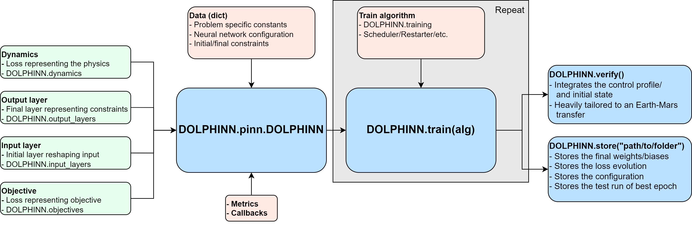

# DOLPHINN

Direct Optimal controL by PHysics Informed Neural Network (DOLPHINN): [Master thesis (TU Delft) project](https://repository.tudelft.nl/islandora/object/uuid%3Abef00e5f-cab2-41e9-af8d-747d1e9284ea?collection=education). This code solves optimal control problems with the direct method by using an unsupervised Physics-Informed Neural Network (PINN) as the latent solution. Below a guide to install DOLPHINN and its dependencies as wel as a simplified explanation of the method that DOLPHINN used to solve optimal control problems with the direct method.

1. [Installation](#installation)
2. [DOLPHINN overview](#design)
2. [Optimal Control Problem with PINN](#ocp)
3. [DOLPHINN advantages](#advantages)

## 1. Installation <a name="installation"></a>

#### Create a virtual environment
Create a virtual anaconda environment with Python 3.10.

```
conda create -n "dolphinn-env" python=3.10
```

#### Dependencies
Install [tudatpy](https://docs.tudat.space/en/latest/), an astrodynamics tool used for verification of optimal control policies of spacecraft trajectories found by the DOLPHINN.

```
conda install -c tudat-team tudatpy
```

Install [my fork of deepxde](https://github.com/thomas7392/deepxde), a neural network module speciliased in Physics-Informed Neural Networks. The fork contains some minimal alterations compared to [the original deepxde](https://github.com/lululxvi/deepxde), which are required to run DOLPHINN. My version contains the perturbed equidistant sampler as well as the incorperations of an objective loss term. This is done by using the regularisation functionality, a bit of a loophole indeed.

```
pip install git+https://github.com/thomas7392/deepxde.git
```


Install Tensorflow 2.8.2 and Tensorflow probability 0.16.0

```
pip install tensorflow==2.8.2
pip install tensorflow-probability==0.16.0
```

#### Install DOLPHINN
Now, finally, install the DOLPHINN package. If you purely want to use DOLPHINN as a python module and keep all functionality as it is here, do this:

```
pip install git+https://github.com/thomas7392/DOLPHINN.git
```

If you want to make personal alterations, your best option is to fork DOLPHINN and clone your fork locally.

```
git clone git@github.com:your_username/DOLPHINN.git
```

## 2. The DOLPHINN code <a name="design"></a>

`DOLPHINN` is built around its central class `DOLPHINN.pinn.DOLPHINN` that defines and solves the optimal control problem or initial value problem. A simplified overview of the workflow with `DOLPHINN` is the following diagram


An extensive tutorial on how the module works and how it can be used to solve user-defined optimal control problems can be found [here](Tutorials/earth_mars_low_thrust_transfer.ipynb).

Short tutorials for specific use cases:

- [Earth-Mars optimal-fuel low-thrust transfer](Tutorials/earth_mars_low_thrust_transfer_short.ipynb)
- [Low Earth orbit propagation](Tutorials/earth_circular_orbit_integration_short.ipynb)

## 3. Optimal Control Problem with PINN <a name="ocp"></a>

The DOLPHINN code uses the following theory to solve an optimal control problem with the direct method and a Physics-Informed Neural Network. A formal introduction is found in my thesis (or hopefully the publication). Consider an optimal control problem 

```math
\begin{alignat}{2}
\text{Minimize}\quad\,\, &J &&=  \Phi(\mathbf{z}_0, \mathbf{z}_f, t_0, t_f) + \int_{t_0}^{t_f} L(\mathbf{z}(t), \mathbf{u}(t))\, dt \\
\text{Subject to}\quad\,\, &\dot{\mathbf{z}} &&= f(\mathbf{z}, \mathbf{u}, t) \quad \mathbf{z} \in \mathbb{R}^N, \mathbf{u} \in \mathbb{R}^Q, t \in [t_0, t_f]\\
&\mathbf{z}(t_0) &&= \mathbf{z}_0\\
&\mathbf{z}(t_f) &&= \mathbf{z}_f
\end{alignat}
```

A neural network $\mathcal{N}$ is designated as the solution. 


The network maps time $t$ to the state $\mathbf{z}$ and control $\mathbf{u}$.

```math
$$\begin{bmatrix} \mathbf{z} \\ \mathbf{u} \end{bmatrix} = \begin{bmatrix} h\big( \mathcal{N}_z (t, p) \big) \\  g\big( \mathcal{N}_u (t, p)\big) \end{bmatrix}$$
```

The design in the thesis includes boundary conditions analytically, through constraints layers $h(\mathcal{N}_z)$ (for the state constraints) and $g(\mathcal{N}_u)$ (for the control constraints). The network is trained through the Physics-Informed method, by using the dynamical constraints $\dot{\mathbf{x}} = f(t, \mathbf{z}, \mathbf{u})$ as the loss function.

$$\mathcal{L} = \dfrac{1}{M} \sum_j^M [\dot{\mathbf{z}} - f(\mathbf{z}, \mathbf{u}, t)]^2$$

The objective of the optimal control problem, $J$, is incorperated as an additional loss term, as proposed by [Mowlawi et al. 2022](https://www.sciencedirect.com/science/article/abs/pii/S002199912200794X).

$$\mathcal{L}_o = J$$

The thesis applied the method to fuel-optimal low-thrust transfer trajectories. Allthough the method described in the thesis is a general method for solving optimal control problems, in its current state, this package is quite tailored to the specific application of spaceraft trajectories.

Example of an Earth-Mars fuel-optimal low-thrust transfer, created as the DOLPHINN is being trained:


## 4. DOLPHINN advantages <a name="advantages"></a>

Two reasons I made DOLPHINN the way it is:
* The DOLPHINN package carufully stores the network configuration and training process. This allows to easily write the solution to disk, and upload the solution again into a DOLPHINN to analyse its outcome or continue training.
* The DOLPHINN repo can serve as a python module, which is quite useful when using it on a supercomputer, like the DelftBlue supercomputer.


