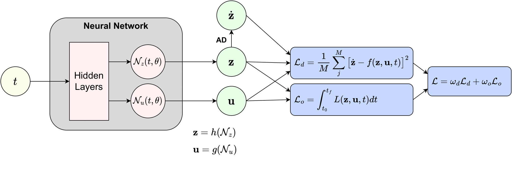

# DOLPHINN

Direct Optimal controL by PHysics Informed Neural Network (DOLPHINN): [Master thesis (TU Delft) project](https://repository.tudelft.nl/islandora/object/uuid%3Abef00e5f-cab2-41e9-af8d-747d1e9284ea?collection=education). This code solves two-boundary-value continious optimal control problems by using an unsupervised Physics-Informed Neural Network as the latent solution. Find here a guide to install DOLPHINN and all its dependencies.

1. [Installation](#installation)
2. [Network Design](#design)
3. [DOLPHINN advantages](#advantages)

## 1. Installation 
Create a virtual anaconda environment with Python 3.10.

`conda create -n "dolphinn-env" python=3.10`

Install tudatpy.

`conda install -c tudat-team tudatpy`

Install my fork of deepxde, that contains some minimal alterations compared to the original deepxde, which are required to run DOLPHINN. My version contains the perturbed equidistant sampler as well as the incorperations of an objective loss term. This is done by using the regularisation functionality, a bit of a loophole indeed.

`pip install git+https://github.com/thomas7392/deepxde.git`

Install Tensorflow 2.8.2

`pip install tensorflow==2.8.2`

Install Tensorflow probability 0.16.0

`pip install tensorflow-probability==0.16.0`

Now, finally, install the DOLPHINN package. If you purely want to use DOLPHINN as a python module and keep all functionality as it is here, do this:

`pip install git+https://github.com/thomas7392/DOLPHINN.git`

If you want to make personal alterations, your best option is to fork DOLPHINN and clone your fork locally.

`git clone git@github.com:your_username/DOLPHINN.git`

## 2. The network design 

That network maps time $t$ to the state $\mathbf{z}$ and control $\mathbf{u}$.

$$\begin{bmatrix} \mathbf{z} \\ \mathbf{u} \end{bmatrix} = \begin{bmatrix} h\big(\mathcal{N}_{\mathbf{z}}(t, \bm{\theta})\big) \\ g\big(\mathcal{N}_{\mathbf{u}}(t, \bm{\theta})\big) \end{bmatrix} $$

The design in the thesis includes boundary conditions analytically, through constraints layers $h(\mathcal{N}_z)$ (for the state constraints) and $g(\mathcal{N}_u)$ (for the control constraints). The network is trained through the Physics-Informed method, by using the dynamical constraints $\dot{\mathbf{x}} = f(t, \mathbf{z}, \mathbf{u})$ as the loss function.

$$\mathcal{L} = \dfrac{1}{M} \sum_j^M [\dot{\mathbf{z}} - f(\mathbf{z}, \mathbf{u}, t)]^2$$

The objective of the optimal control problem, $J$, is incorperated as an additional loss term, as proposed by [Mowlawi et al. 2022](https://www.sciencedirect.com/science/article/abs/pii/S002199912200794X).

$$\mathcal{L}_o = J$$

The thesis applied the method to fuel-optimal low-thrust transfer trajectories. Allthough the method described in the thesis is a general method for solving optimal control problems, in its current state, this package is quite tailored to the specific application of spaceraft trajectories.

Example of an Earth-Mars fuel-optimal low-thrust transfer, created as the DOLPHINN is being trained:

## 3. DOLPHINN advantages 

Two reasons I made DOLPHINN the way it is:
* The DOLPHINN package carufully stores the network configuration and training process. This allows to easily write the solution to disk, and upload the solution again into a DOLPHINN to analyse its outcome or continue training.
* The DOLPHINN repo can serve as a python module, which is quite useful when using it on a supercomputer, like the DelftBlue supercomputer.

